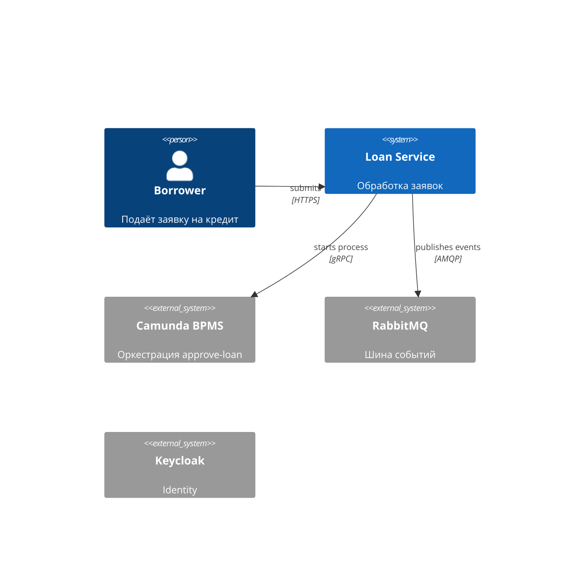

# sdd-generator

> Spec-anchored development driver, powered by Claude.
> CLI, который превращает разговор о фиче в полноценный **Software Design Document** по arc42 / IEEE 29148 — с диаграммами, ADR, traceability и каталогом интеграций.

> ⚠️ **Статус:** pre-implementation. Репозиторий содержит спецификацию (`SDD_CREATOR.md`), `package.json` и исходники появятся в Phase 1 разработки.

---

## Зачем

Команда хочет писать SDD до кода, но:
- Заполнять шаблон руками — лень, поэтому SDD пишется "потом" (читай: никогда).
- LLM-генератор без структуры выдаёт красивый текст без traceability и без NFR.
- Интеграции с внешними системами (Camunda, Kafka, Keycloak) обычно описываются абзацем "ну там Kafka".

`sdd-generator` решает это так:

1. Интерактивный диалог с Claude собирает **структурированные требования** (`requirements.json`).
2. Отдельная команда собирает **каталог интеграций** (`integrations.json`) — с per-category шаблонами для BPMS, message-broker, БД и т.д.
3. Генератор рендерит **Markdown SDD** + отдельный **INTEGRATIONS.md**, с C4/BPMN/ER-диаграммами на Mermaid.
4. Линтер проверяет полноту по чек-листу arc42 — нельзя забыть DR, observability или traceability matrix.

---

## Quick install

```bash
npm install -g sdd-generator
sdd --help
```

> До первого релиза: `git clone … && npm install && npm link`.

### Выбор Claude provider

Поддерживаются два режима — выбирается на `sdd init` или через флаг `--provider` / env-переменную `SDD_CLAUDE_PROVIDER`.

**1. `cli` — локальный Claude Code CLI (по умолчанию, console subscription).** Для тех, у кого уже есть подписка Claude Pro / Max / Team — оплата идёт через подписку, отдельный API-ключ не нужен. Инструмент вызывает локальный бинарник `claude` (см. [Claude Code](https://claude.com/claude-code)) в headless-режиме:

```bash
# один раз — установить и залогиниться
npm install -g @anthropic-ai/claude-code
claude login                           # OAuth через браузер, привяжет подписку

# дальше — sdd работает без API-ключа
sdd init
```

Под капотом `cli`-провайдер делает `claude -p "<prompt>" --output-format json` и парсит ответ. Если нужен другой бинарник — `SDD_CLAUDE_CLI_BIN=/path/to/claude`. Модель можно зафиксировать: `SDD_CLAUDE_MODEL=claude-opus-4-7`.

**2. `api` — Anthropic API.** Когда нет подписки или нужен прямой биллинг по токенам (CI/CD, скрипты):

```bash
export SDD_CLAUDE_PROVIDER=api
export ANTHROPIC_API_KEY=sk-ant-...
```

| Провайдер | Когда выбирать | Лимиты |
|---|---|---|
| `cli` *(default)* | Локальная работа с подпиской Pro/Max/Team | rate-limits подписки, требует залогиненный `claude` |
| `api` | CI/CD, скрипты, нет подписки | биллинг по токенам |

---

## 5-минутный тур

### 1. `sdd init` — завести проект

```bash
$ sdd init
? Project name: loan-service
? Description: Микросервис обработки заявок на кредит
? Version: 0.1.0
? Author: Eldar <eldar@example.com>
? Language: › Java
? Framework: › Spring Boot 3.3
? Architecture: › Hexagonal
? Technologies: ◉ PostgreSQL ◉ Camunda ◉ RabbitMQ ◉ Keycloak
? Team size: 4
? Complexity: medium
? Deadline: 2026-Q3

✔ Created .sdd/config.json
✔ Created .sdd/requirements.json (skeleton)
✔ Copied templates for java/spring-boot + hexagonal
```

Результат — `.sdd/` в корне проекта:

```
.sdd/
├── config.json          # метаданные проекта, стек, архитектура
├── requirements.json    # пустой каркас
└── integrations.json    # пустой каркас
```

### 2. `sdd brainstorm` — собрать требования по этапам

Brainstorm — это **не один цикл**, а серия суб-этапов. Любой можно пропустить и добавить позже.

```bash
$ sdd brainstorm
? Что хотите проработать?
  ❯ stakeholders   — кто пользователи, заказчик, оператор
    context        — problem statement, цели, KPIs
    constraints    — регуляторика, бюджет, технологические лимиты
    glossary       — ubiquitous language
    features       — use cases, FRs, acceptance criteria
    domain         — bounded contexts, агрегаты, события (DDD)
    quality        — измеримые NFR (p95, RTO/RPO)
    anti           — out of scope
    compliance     — security & compliance
    [Skip for now]
```

Пример прохода `features`:

```
? Опишите фичу: Заявка на кредит подаётся клиентом через мобильное приложение,
проходит автоматический скоринг, в случае пограничного score уходит на ручной
андеррайтинг, по подтверждению выпускается договор.

🤖 Claude: уточняющие вопросы
  1. Какой допустимый latency для скоринга? (sync vs async)
  2. Что делать при таймауте бюро кредитных историй?
  3. Возможно ли частичное одобрение (на меньшую сумму)?
  ...

✔ Сохранено: FR-001 "Loan application intake"
   • 6 acceptance criteria
   • 3 risks identified
   • 2 NFR scenarios (NFR-001, NFR-002)
   • Связано с интеграциями: [Camunda BPMS, RabbitMQ] — добавить сейчас? (y/N)
```

После прогона `requirements.json` выглядит так:

```json
{
  "schemaVersion": 1,
  "stakeholders": { "status": "completed", "data": [...] },
  "context":      { "status": "completed", "data": {...} },
  "glossary":     { "status": "skipped" },
  "features": {
    "status": "completed",
    "data": [
      {
        "id": "FR-001",
        "title": "Loan application intake",
        "description": "...",
        "acceptanceCriteria": [
          { "id": "AC-001-1", "given": "клиент авторизован",
            "when": "подаёт заявку", "then": "получает trackingId за <500ms" }
        ],
        "risks": [{ "id": "RISK-001", "likelihood": "medium",
                    "impact": "high", "mitigation": "..." }],
        "usesIntegrations": ["INT-001", "INT-002"]
      }
    ]
  },
  "nfrs": { "status": "completed", "data": [
    { "id": "NFR-001", "category": "performance",
      "scenario": "p95 < 500ms на /loans при 200 RPS" }
  ]}
}
```

### 3. `sdd integrations` — каталог зависимых систем

Отдельная команда: интеграции живут собственным жизненным циклом.

```bash
$ sdd integrations add
? Категория:
  ❯ bpms / workflow      (Camunda, Temporal, Flowable)
    message-broker       (RabbitMQ, Kafka, NATS)
    database
    cache
    identity
    storage
    observability
    search
    payment
    notification
    external-api
    legacy
    custom

? Категория › bpms
? Какой движок? Camunda 8 (Zeebe)
? Назначение: оркестрация процесса approve-loan
? Критичность: critical
? Какие BPMN-процессы? loan-approval-process
? Job workers (по типу)? credit-check, underwriting, contract-sign
? Correlation key? applicationId
? Что делаем при недоступности Zeebe?
   ❯ circuit breaker → degraded mode (синхронный fallback)
     fail fast
     retry с экспонентой
? SLA провайдера: 99.9% / p95 200ms
? Compliance? PII в payload запрещено

✔ Сохранено: INT-001 Camunda BPMS
```

Аналогично для RabbitMQ:

```bash
$ sdd integrations add --category message-broker
? Брокер › RabbitMQ
? Топология exchange→queue:
   • loan.events (topic) → loan.events.scoring.q
   • loan.events (topic) → loan.events.audit.q
? Producer'ы: LoanCommandHandler
? Consumer'ы: ScoringWorker, AuditLogger
? Ordering guarantee? per partition (routing key = applicationId)
? At-least-once + idempotency? messageId-based dedup, окно 24h
? DLQ-стратегия? loan.events.dlq + alert после 100 msgs
? Retention? 7 дней

✔ Сохранено: INT-002 RabbitMQ
```

`integrations.json`:

```json
{
  "schemaVersion": 1,
  "integrations": [
    {
      "id": "INT-001",
      "name": "Camunda BPMS",
      "category": "bpms",
      "vendor": "Camunda", "version": "8.5",
      "criticality": "critical",
      "purpose": "Оркестрация процесса approve-loan",
      "protocol": "gRPC + REST",
      "authMethod": "OAuth2 client-credentials",
      "topicsOrQueues": ["loan-approval-process"],
      "sla": { "availability": "99.9%", "latencyP95Ms": 200 },
      "errorHandling": "circuit breaker → degraded mode",
      "idempotency": "messageId dedup 24h",
      "owner": "Platform Team",
      "secretsRef": "vault://camunda/prod"
    },
    {
      "id": "INT-002",
      "name": "RabbitMQ",
      "category": "message-broker",
      "criticality": "critical",
      "protocol": "AMQP 0.9.1",
      "topology": {
        "exchanges": [{ "name": "loan.events", "type": "topic" }],
        "queues": ["loan.events.scoring.q", "loan.events.audit.q"],
        "dlq": "loan.events.dlq"
      },
      "ordering": "per-partition by routingKey=applicationId",
      "delivery": "at-least-once + dedup"
    }
  ]
}
```

Управление:

```bash
sdd integrations list
sdd integrations show INT-001
sdd integrations edit INT-001
sdd integrations remove INT-001
sdd integrations validate
sdd integrations import --from asyncapi rabbit.yaml   # авто-заполнение
sdd integrations import --from bpmn loan-approval.bpmn
```

### 4. `sdd spec` — собрать документы

```bash
$ sdd spec
✔ Loaded config + requirements + integrations
✔ Generated Executive Summary
✔ Generated Stakeholders & Personas
✔ Generated Glossary (skipped — placeholder)
✔ Generated C4 Context diagram (Mermaid)
✔ Generated C4 Container diagram
✔ Generated Domain Model (Mermaid class)
✔ Generated Risks Register (3 risks)
✔ Generated Traceability Matrix (FR → design → test → code)
✔ Wrote docs/SDD.md (47 KB)

$ sdd integrations spec
✔ Wrote docs/INTEGRATIONS.md (12 KB)
   • INT-001 Camunda — BPMN diagram + saga flow
   • INT-002 RabbitMQ — topology diagram
```

В итоге:

```
docs/
├── SDD.md            # основной документ, ссылается на INTEGRATIONS.md
└── INTEGRATIONS.md   # отдельный документ по зависимым системам
```

Фрагмент `docs/SDD.md`:

````markdown
## 3. System Architecture

### 3.1 Context Diagram



> Полные карточки внешних систем — см. [INTEGRATIONS.md](./INTEGRATIONS.md).
````

---

## Skip & Resume

На любом этапе — `Skip for now`. Запись остаётся в `requirements.json` со `status: "skipped"`. Возврат:

```bash
sdd status                    # что собрано / skipped / stale
sdd add stakeholders          # добраться до конкретного этапа
sdd add feature               # одиночная фича без полного цикла
sdd add adr                   # зафиксировать architecture decision
sdd add risk
sdd edit glossary             # перезапустить интерактив поверх
sdd remove glossary           # вернуть в "skipped"
sdd spec --update             # догенерить только новые/изменённые секции
```

`stale` выставляется автоматически: добавили фичу → glossary помечается stale → подсказка `sdd edit glossary`.

---

## Lint: формальная полнота

```bash
$ sdd lint
✖ FR-003: нет acceptance criteria
✖ NFR-002: target не измерим ("должно быть быстро")
⚠ Glossary: status=skipped (run `sdd add glossary`)
⚠ INT-001: secretsRef не указан
✖ ADR-002: ссылается на несуществующий FR-099
✔ Mermaid blocks: 7/7 валидны
✔ Traceability: 12/12 FR покрыты тестами

3 errors, 2 warnings
```

`sdd lint --strict` ломается на skipped секциях (полезно в CI перед релизом).

---

## Экспорт

```bash
sdd spec --format pdf
sdd spec --format html
sdd spec --format confluence --space ENG --parent 12345
sdd integrations spec --format pdf
```

---

## Архитектура самого инструмента

Hexagonal / ports & adapters. Зависимости направлены строго внутрь:

```
src/
├── commands/        # Commander.js wrappers — тонкие, только wiring
├── application/     # use-case services (Init, Brainstorm, Integrations, Spec)
├── domain/          # Чистая логика: ConfigManager, Validator, PromptBuilder, TemplateEngine
├── ports/           # IFileRepository, IClaudeProvider, IIntegrationImporter, ILogger
├── adapters/        # fs/promises, @anthropic-ai/sdk, OpenAPI/AsyncAPI/BPMN importers, winston
└── templates/
    ├── stacks/         java/ nodejs/ python/ go/ rust/
    ├── architectures/  hexagonal/ layered/ microservices/ event-driven/ monolith/
    └── integrations/   bpms/ message-broker/ database/ cache/ identity/ … (per-category prompts + schemas + Handlebars)
```

Подробности — см. [SDD_CREATOR.md](./SDD_CREATOR.md).

---

## Поддерживаемые опции

**Языки/стеки:** Java + Spring Boot, Node.js + NestJS, Python + FastAPI, Go, Rust.

**Архитектуры:** Hexagonal, Layered, Microservices, Event-driven, Monolith.

**Категории интеграций:**

| Категория | Примеры |
|---|---|
| `bpms` / `workflow` | Camunda 7/8 (Zeebe), Flowable, Temporal, Conductor |
| `message-broker` | RabbitMQ, Kafka, NATS, ActiveMQ, AWS SQS/SNS, GCP Pub/Sub |
| `database` | PostgreSQL, MySQL, MongoDB, Cassandra, ClickHouse |
| `cache` | Redis, Memcached, Hazelcast |
| `search` | Elasticsearch, OpenSearch, Meilisearch |
| `identity` | Keycloak, Auth0, Okta, AWS Cognito |
| `storage` | S3, MinIO, GCS, Azure Blob |
| `observability` | Prometheus, Grafana, Loki, Jaeger, Datadog |
| `payment` | Stripe, PayPal, YooKassa |
| `notification` | Twilio, SendGrid, FCM, APNs |
| `external-api` | произвольные REST/GraphQL/gRPC |
| `legacy` | SOAP, мейнфрейм |
| `custom` | всё остальное |

---

## Конфигурация

```bash
# .env

# Claude provider — cli (default, console subscription) | api
SDD_CLAUDE_PROVIDER=cli

# Если provider=cli (Claude Code CLI, для подписчиков Pro/Max)
SDD_CLAUDE_CLI_BIN=claude               # необязательно — берётся из PATH
SDD_CLAUDE_MODEL=claude-opus-4-7        # необязательный override модели
SDD_CLAUDE_CLI_TIMEOUT_MS=120000        # таймаут на вызов CLI

# Если provider=api
ANTHROPIC_API_KEY=sk-ant-...

LOG_LEVEL=info                          # debug в --verbose
SDD_GENERATOR_CACHE=true                # кэш Claude-ответов по content-hash
SDD_GENERATOR_TEMPLATES_DIR=./templates # override каталога шаблонов
```

Precedence: CLI flag > env var > `.sdd/config.json` > `~/.sdd/config.json` > defaults.

---

## Roadmap

**v1.0.0**

- [ ] `init` / `brainstorm` (10 этапов) / `integrations` / `spec` / `lint` / `add` / `edit` / `remove` / `status`
- [ ] Output: `docs/SDD.md` + `docs/INTEGRATIONS.md`
- [ ] Stable IDs (FR/NFR/ADR/RISK/INT) + traceability matrix
- [ ] Diagrams: C4 (L1–L3), Mermaid class, ER, sequence, BPMN, broker topology
- [ ] Industry presets: fintech / healthcare / e-commerce
- [ ] Importers: OpenAPI / AsyncAPI / BPMN
- [ ] Export: PDF / HTML / Confluence
- [ ] `migrate` для `schemaVersion` bump
- [ ] Stacks: Java, Node, Python, Go, Rust × 5 архитектур
- [ ] Два Claude-провайдера через единый порт `IClaudeProvider`: `api` (Anthropic API) и `cli` (Claude Code CLI для подписчиков Pro/Max)

**Post-launch**

- `view` для рендера в TUI
- Web UI
- VS Code extension
- GitHub Actions: `sdd lint` в CI, авто-PR при `--update`
- Импорт из JIRA / Linear

---

## Дальше

- Полная спецификация и план реализации: [SDD_CREATOR.md](./SDD_CREATOR.md)
- Гайдлайны для AI-агентов в репо: [CLAUDE.md](./CLAUDE.md)

---

## License

MIT (планируется).
