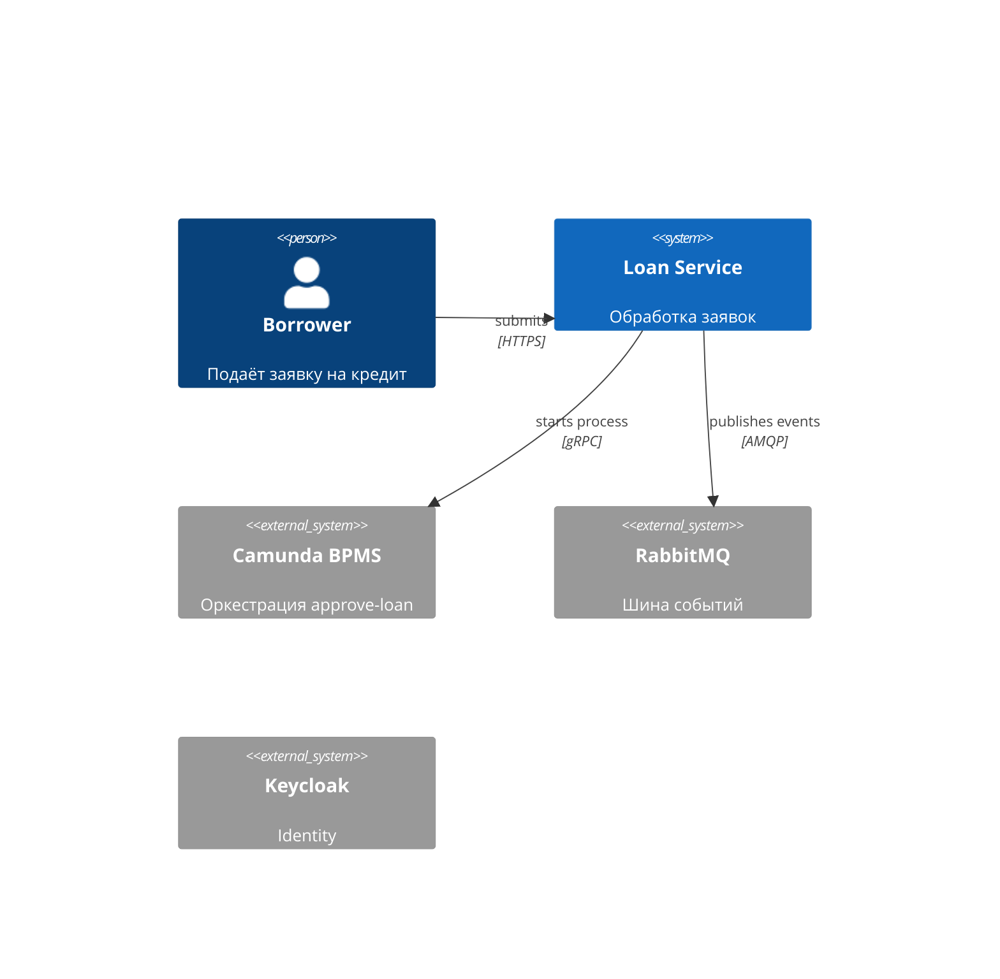

# sdd-generator

> Spec-anchored development driver, powered by Claude.
> CLI, который превращает разговор о фиче в полноценный **Software Design Document** по arc42 / IEEE 29148 — с диаграммами, ADR, traceability и каталогом интеграций.

> ⚠️ **Статус:** Phase 6 завершена. Готовы: `sdd init` (+ `--industry fintech|healthcare|e-commerce`), `sdd brainstorm <topic>` (10 этапов), `sdd integrations <list|show|add|edit|remove|validate|import|spec>` (13 категорий + OpenAPI/AsyncAPI/BPMN импортёры), `sdd spec` (14 секций arc42/IEEE 29148, авто-Mermaid + валидация, `--update` diff-mode + `--format html|pdf|confluence` через pandoc), `sdd status`, `sdd add|edit|remove <topic>`, `sdd add feature|adr|risk|integration`, `sdd lint` (+`--strict`, `--warnings-as-errors`, exit codes 0/1/2), `sdd import --from md|jira|linear`, `sdd migrate`. Тестовое покрытие: 42 suites / 197 tests / 3 snapshot'а; gates — domain ≥90%, adapters ≥75%, application ≥85%, utils ≥95% (см. `jest.config.js`). E2E full-workflow + contract tests для всех портов. Осталось Phase 7 (CLI polish: error classes / exit codes / `--verbose`), Phase 8 (build & npm publish).

---

## Зачем

Команда хочет писать SDD до кода, но:
- Заполнять шаблон руками — лень, поэтому SDD пишется "потом" (читай: никогда).
- LLM-генератор без структуры выдаёт красивый текст без traceability и без NFR.
- Интеграции с внешними системами (Camunda, Kafka, Keycloak) обычно описываются абзацем "ну там Kafka".

`sdd-generator` решает это так:

1. Интерактивный диалог с Claude собирает **структурированные требования** (`requirements.json`).
2. Отдельная команда собирает **каталог интеграций** (`integrations.json`) — с per-category шаблонами для BPMS, message-broker, БД и т.д.
3. Генератор рендерит **Markdown SDD** + отдельный **INTEGRATIONS.md**, с C4/BPMN/ER-диаграммами на Mermaid.
4. Линтер проверяет полноту по чек-листу arc42 — нельзя забыть DR, observability или traceability matrix.

---

## Quick install

```bash
npm install -g sdd-generator
sdd --help
```

> До первого релиза: `git clone … && npm install && npm link`.

### Выбор Claude provider

Поддерживаются два режима — выбирается на `sdd init` или через флаг `--provider` / env-переменную `SDD_CLAUDE_PROVIDER`.

**1. `cli` — локальный Claude Code CLI (по умолчанию, console subscription).** Для тех, у кого уже есть подписка Claude Pro / Max / Team — оплата идёт через подписку, отдельный API-ключ не нужен. Инструмент вызывает локальный бинарник `claude` (см. [Claude Code](https://claude.com/claude-code)) в headless-режиме:

```bash
# один раз — установить и залогиниться
npm install -g @anthropic-ai/claude-code
claude login                           # OAuth через браузер, привяжет подписку

# дальше — sdd работает без API-ключа
sdd init
```

Под капотом `cli`-провайдер делает `claude -p "<prompt>" --output-format json` и парсит ответ. Если нужен другой бинарник — `SDD_CLAUDE_CLI_BIN=/path/to/claude`. Модель можно зафиксировать: `SDD_CLAUDE_MODEL=claude-opus-4-7`.

**2. `api` — Anthropic API.** Когда нет подписки или нужен прямой биллинг по токенам (CI/CD, скрипты):

```bash
export SDD_CLAUDE_PROVIDER=api
export ANTHROPIC_API_KEY=sk-ant-...
```

| Провайдер | Когда выбирать | Лимиты |
|---|---|---|
| `cli` *(default)* | Локальная работа с подпиской Pro/Max/Team | rate-limits подписки, требует залогиненный `claude` |
| `api` | CI/CD, скрипты, нет подписки | биллинг по токенам |

---

## 5-минутный тур

### 1. `sdd init` — завести проект

```bash
$ sdd init
? Project name: loan-service
? Project description (optional): Микросервис обработки заявок на кредит
? Owner / team (optional): platform-team
? Repository URL (optional): https://github.com/example/loan-service
? Claude provider: › cli
? Stack: › java
? Architecture: › hexagonal
? Doc language: › en
? Technologies (comma-separated): Spring Boot 3, PostgreSQL 16, RabbitMQ, Keycloak
? Claude model override (optional):

SDD project initialised.
  config:        .sdd/config.json
  requirements:  .sdd/requirements.json
  integrations:  .sdd/integrations.json
  stack tmpl:    .sdd/templates/stack.md
  arch  tmpl:    .sdd/templates/architecture.md
  Claude CLI:    2.1.126 (Claude Code)
```

**Идемпотентность.** При повторном запуске:

| Флаг       | Поведение                                                     |
| ---------- | ------------------------------------------------------------- |
| (default)  | abort с сообщением, что `.sdd/` уже существует                |
| `--force`  | удалить `.sdd/` и пересоздать                                 |
| `--merge`  | оставить уже существующие файлы, дописать только недостающие  |

**Без интерактива** (для CI и воспроизводимых демо):

```bash
sdd init --non-interactive --config init.json
```

`init.json`:

```json
{
  "metadata": { "name": "loan-service", "description": "demo" },
  "stack": "java",
  "architecture": "hexagonal",
  "language": "en",
  "technologies": ["Spring Boot 3", "PostgreSQL 16"],
  "claudeProvider": "cli"
}
```

Результат — `.sdd/` в корне проекта:

```
.sdd/
├── config.json              # метаданные проекта, стек, архитектура, claude.provider
├── requirements.json        # пустой каркас всех 10 топиков (status: pending)
├── integrations.json        # { schemaVersion, integrations: [] }
└── templates/
    ├── stack.md             # отрендеренный per-stack init template
    └── architecture.md      # отрендеренный per-architecture init template
```

Для `provider=cli` команда дополнительно делает `claude --version` probe — если CLI не установлен или не залогинен, выводится подсказка, но `init` **не падает**.

### 2. `sdd brainstorm <topic>` — собрать требования по этапам

Brainstorm — это **не один цикл**, а серия суб-команд (по одной на топик). Любую можно пропустить и добавить позже. Поддерживаемые топики:

```
stakeholders | context | constraints | glossary | features
domain       | quality | dependencies | anti     | compliance
```

Опции каждой суб-команды:

| Флаг                       | Что делает                                                                                       |
| -------------------------- | ------------------------------------------------------------------------------------------------ |
| `-d, --description <text>` | Передать описание/инпут одной строкой                                                            |
| `-i, --input <file>`       | Прочитать описание из файла (удобно для CI и большого Markdown)                                  |
| `--skip`                   | Не звать Claude, выставить `status: "skipped"` + `skippedAt`                                     |

Пример:

```bash
$ sdd brainstorm features --description "Customer submits a loan application; system performs automated scoring; borderline cases go to manual underwriting."

✔ brainstorm features — completed @ 2026-05-03T11:02:31.014Z
  inputsHash: 8f0c…b431
```

`requirements.json` после прогона:

```json
{
  "schemaVersion": 1,
  "features": {
    "state": { "status": "completed", "updatedAt": "2026-05-03T11:02:31.014Z", "inputsHash": "8f0c…" },
    "items": [
      {
        "id": "FR-001",
        "title": "Submit loan application",
        "description": "...",
        "priority": "must",
        "acceptanceCriteria": [
          { "id": "AC-FR-001-1", "given": "logged-in customer", "when": "valid submission", "then": "confirmation displayed" }
        ],
        "usesIntegrations": ["INT-001"]
      }
    ]
  }
}
```

**Стабильные ID** генерируются клиентом (`FR-NNN`, `NFR-NNN`, `SH-NNN`, `AC-FR-NNN-N`) — Claude их не выдумывает.

**Зависимости между топиками.** Если перегенерировать топик, от которого зависят другие *completed*-секции, они автоматически становятся `stale` (см. `TOPIC_DEPENDENCIES` в `StatusTracker`):

```
stakeholders → context → constraints
glossary → features → { domain, quality, dependencies }
context → anti
constraints → compliance
```

**Skip:**

```bash
sdd brainstorm anti --skip
# ⏭ brainstorm anti — skipped at 2026-05-03T11:03:08.221Z
```

**Per-stack overrides.** Базовые промпты живут в `src/templates/base/brainstorm/<topic>.prompt`. Если нужен стек-специфичный промпт, положите его в `src/templates/stacks/<stack>/prompts/brainstorm-<topic>.prompt` — `PromptLoader` подхватит его автоматически вместо базового.

**Кэш.** Все вызовы Claude обёрнуты в `CachingClaudeProvider` — повтор brainstorm с теми же входами читается из `.sdd/cache/`, без сжигания токенов/подписки.

### 3. `sdd integrations` — каталог зависимых систем

Интеграции живут собственным жизненным циклом и хранятся в `.sdd/integrations.json`. Поддерживаются 13 категорий с per-category Zod-схемами для `extra`:

```
bpms | message-broker | database | cache | search | identity | storage
observability | payment | notification | external-api | legacy | custom
```

**Sub-commands:**

```bash
sdd integrations list                          # таблица INT-NNN | category | name
sdd integrations show INT-001                  # JSON одной интеграции
sdd integrations add --input camunda.json      # payload должен валидироваться per-category
sdd integrations edit INT-001 -i patch.json    # merge-patch (категорию менять нельзя)
sdd integrations remove INT-001
sdd integrations validate                      # per-category extras + endpoints + secretsRef warning
sdd integrations import --from openapi --file bureau.json
sdd integrations import --from asyncapi --file orders.json
sdd integrations import --from bpmn --file loan-origination.bpmn
sdd integrations spec [-o docs/INTEGRATIONS.md]
```

**Пример `camunda.json`** (без `id` — генерируется автоматически как `INT-NNN`):

```json
{
  "category": "bpms",
  "name": "Camunda 8",
  "vendor": "Camunda",
  "purpose": "Loan origination workflow",
  "endpoints": [{ "name": "gateway", "protocol": "grpc", "url": "zeebe://camunda:26500" }],
  "auth": { "mode": "oauth2", "secretsRef": "vault://camunda/sa" },
  "errorHandling": "circuit breaker → degraded mode",
  "extra": {
    "engine": "camunda-8",
    "processes": ["loanOrigination"],
    "jobWorkers": ["credit-check", "underwriting"],
    "correlationKeys": ["applicationId"],
    "sagas": ["manual-underwriting"],
    "retentionDays": 30,
    "bpmnFile": "./bpmn/loan-origination.bpmn"
  }
}
```

**Импортёры.** `import` подхватывает уже существующие спецификации:
- `--from openapi` (JSON OpenAPI 3.x) → создаёт `external-api` с `extra.operations` и серверами.
- `--from asyncapi` (JSON AsyncAPI 2.x) → создаёт `message-broker` с топиками и consumer-группами.
- `--from bpmn` (BPMN-XML) → создаёт `bpms` с processes / jobWorkers / sagas (regex-парсер, без новых deps).

YAML-варианты OpenAPI/AsyncAPI пока требуют ручной конвертации в JSON.

**`spec` рендерит `docs/INTEGRATIONS.md`** через Handlebars-шаблоны:
- `_base/overview.hbs` — таблица всех интеграций.
- `_base/cross-cutting.hbs` — общие требования (secrets, rate-limit, observability).
- `_base/section.hbs` — карточка на каждую интеграцию (purpose / endpoints / SLA / auth / categoryExtra JSON).
- `<category>/diagram.hbs` (для bpms / message-broker / database) — Mermaid диаграмма.
- `_base/traceability.hbs` — таблица "интеграция → FR-NNN использующие её".

### 4. `sdd spec` — собрать документы

```bash
$ sdd spec
✔ Wrote /work/loan-service/docs/SDD.md
  ✓ Executive Summary
  ✓ Stakeholders & Personas
  ✓ Product Requirements
  ✓ Quality Attributes
  ✓ Glossary
  ✓ System Architecture
  ✓ Detailed Design
  ✓ Testing Strategy
  ✓ Deployment & Operations
  ✓ Implementation Plan
  ✓ Architecture Decision Records
  ✓ Risks Register
  ✓ Compliance & Security
  ✓ Traceability

$ sdd integrations spec
✔ Wrote docs/INTEGRATIONS.md
   • INT-001 Camunda — BPMN diagram + extras
   • INT-002 RabbitMQ — topology diagram
```

**Доступные опции `sdd spec`:**

| Опция                  | Что делает                                                                 |
| ---------------------- | -------------------------------------------------------------------------- |
| `-o, --output <file>`  | Кастомный путь вывода (по-умолчанию `docs/SDD.md`)                         |
| `--placeholders`       | Skipped секции вставляются как плейсхолдеры с `> ⏭ Section skipped`        |
| `--update`             | Регенерация только секций с изменившимся хэшем входов (зарезервировано)    |

**Что включено в SDD.md:**
- 14 секций (arc42 / IEEE 29148): Executive Summary → Traceability.
- Авто-генерация Mermaid: `C4Context` (по `integrations[]`), `classDiagram` (по `domain.aggregates`), `erDiagram` (по entities), `flowchart` topology брокеров.
- Claude генерит: narrative для Architecture / Detailed Design / Testing / Deployment-Ops / Implementation Plan, плюс `C4Container`, `C4Component`, `sequenceDiagram` per-feature.
- Mermaid-валидатор (`MermaidValidator`) проверяет header + balanced brackets; невалидные блоки помечаются `<!-- TODO: human review -->`. Re-prompt — до 2 попыток.
- Skipped секции: либо опускаются (default), либо рендерятся как плейсхолдеры (`--placeholders`).

В итоге:

```
docs/
├── SDD.md            # основной документ, ссылается на INTEGRATIONS.md
└── INTEGRATIONS.md   # отдельный документ по зависимым системам
```

Фрагмент `docs/SDD.md`:

````markdown
## 3. System Architecture

### 3.1 Context Diagram


```mermaid
C4Context
    Person(client, "Borrower", "Подаёт заявку на кредит")
    System(loan, "Loan Service", "Обработка заявок")
    System_Ext(camunda, "Camunda BPMS", "Оркестрация approve-loan")
    System_Ext(rabbit, "RabbitMQ", "Шина событий")
    System_Ext(keycloak, "Keycloak", "Identity")
    Rel(client, loan, "submits", "HTTPS")
    Rel(loan, camunda, "starts process", "gRPC")
    Rel(loan, rabbit, "publishes events", "AMQP")
```

> Полные карточки внешних систем — см. [INTEGRATIONS.md](./INTEGRATIONS.md).
````

---

## Skip & Resume

На любом этапе — `Skip for now`. Запись остаётся в `requirements.json` со `status: "skipped"`. Возврат:

```bash
sdd status                    # что собрано / skipped / stale
sdd add stakeholders          # добраться до конкретного этапа
sdd add feature               # одиночная фича без полного цикла
sdd add adr                   # зафиксировать architecture decision
sdd add risk
sdd edit glossary             # перезапустить интерактив поверх
sdd remove glossary           # вернуть в "skipped"
sdd spec --update             # догенерить только новые/изменённые секции
```

`stale` выставляется автоматически: добавили фичу → glossary помечается stale → подсказка `sdd edit glossary`.

---

## Lint: формальная полнота

```bash
$ sdd lint
✖ FR-003: нет acceptance criteria
✖ NFR-002: target не измерим ("должно быть быстро")
⚠ Glossary: status=skipped (run `sdd add glossary`)
⚠ INT-001: secretsRef не указан
✖ ADR-002: ссылается на несуществующий FR-099
✔ Mermaid blocks: 7/7 валидны
✔ Traceability: 12/12 FR покрыты тестами

3 errors, 2 warnings
```

`sdd lint --strict` ломается на skipped секциях (полезно в CI перед релизом).

---

## Экспорт

```bash
sdd spec --format pdf
sdd spec --format html
sdd spec --format confluence --space ENG --parent 12345
sdd integrations spec --format pdf
```

---

## Архитектура самого инструмента

Hexagonal / ports & adapters. Зависимости направлены строго внутрь:

```
src/
├── commands/        # Commander.js wrappers — тонкие, только wiring
├── application/     # use-case services (Init, Brainstorm, Integrations, Spec)
├── domain/          # Чистая логика: ConfigManager, Validator, PromptBuilder, TemplateEngine
├── ports/           # IFileRepository, IClaudeProvider, IIntegrationImporter, ILogger
├── adapters/        # fs/promises, @anthropic-ai/sdk, OpenAPI/AsyncAPI/BPMN importers, winston
└── templates/
    ├── stacks/         java/ nodejs/ python/ go/ rust/
    ├── architectures/  hexagonal/ layered/ microservices/ event-driven/ monolith/
    └── integrations/   bpms/ message-broker/ database/ cache/ identity/ … (per-category prompts + schemas + Handlebars)
```

Подробности — см. [SDD_CREATOR.md](./SDD_CREATOR.md).

---

## Поддерживаемые опции

**Языки/стеки:** Java + Spring Boot, Node.js + NestJS, Python + FastAPI, Go, Rust.

**Архитектуры:** Hexagonal, Layered, Microservices, Event-driven, Monolith.

**Категории интеграций:**

| Категория | Примеры |
|---|---|
| `bpms` / `workflow` | Camunda 7/8 (Zeebe), Flowable, Temporal, Conductor |
| `message-broker` | RabbitMQ, Kafka, NATS, ActiveMQ, AWS SQS/SNS, GCP Pub/Sub |
| `database` | PostgreSQL, MySQL, MongoDB, Cassandra, ClickHouse |
| `cache` | Redis, Memcached, Hazelcast |
| `search` | Elasticsearch, OpenSearch, Meilisearch |
| `identity` | Keycloak, Auth0, Okta, AWS Cognito |
| `storage` | S3, MinIO, GCS, Azure Blob |
| `observability` | Prometheus, Grafana, Loki, Jaeger, Datadog |
| `payment` | Stripe, PayPal, YooKassa |
| `notification` | Twilio, SendGrid, FCM, APNs |
| `external-api` | произвольные REST/GraphQL/gRPC |
| `legacy` | SOAP, мейнфрейм |
| `custom` | всё остальное |

---

## Конфигурация

```bash
# .env

# Claude provider — cli (default, console subscription) | api
SDD_CLAUDE_PROVIDER=cli

# Если provider=cli (Claude Code CLI, для подписчиков Pro/Max)
SDD_CLAUDE_CLI_BIN=claude               # необязательно — берётся из PATH
SDD_CLAUDE_MODEL=claude-opus-4-7        # необязательный override модели
SDD_CLAUDE_CLI_TIMEOUT_MS=120000        # таймаут на вызов CLI

# Если provider=api
ANTHROPIC_API_KEY=sk-ant-...

LOG_LEVEL=info                          # debug в --verbose
SDD_GENERATOR_CACHE=true                # кэш Claude-ответов по content-hash
SDD_GENERATOR_TEMPLATES_DIR=./templates # override каталога шаблонов
```

Precedence: CLI flag > env var > `.sdd/config.json` > `~/.sdd/config.json` > defaults.

---

## Roadmap

**v1.0.0**

- [ ] `init` / `brainstorm` (10 этапов) / `integrations` / `spec` / `lint` / `add` / `edit` / `remove` / `status`
- [ ] Output: `docs/SDD.md` + `docs/INTEGRATIONS.md`
- [ ] Stable IDs (FR/NFR/ADR/RISK/INT) + traceability matrix
- [ ] Diagrams: C4 (L1–L3), Mermaid class, ER, sequence, BPMN, broker topology
- [ ] Industry presets: fintech / healthcare / e-commerce
- [ ] Importers: OpenAPI / AsyncAPI / BPMN
- [ ] Export: PDF / HTML / Confluence
- [ ] `migrate` для `schemaVersion` bump
- [ ] Stacks: Java, Node, Python, Go, Rust × 5 архитектур
- [ ] Два Claude-провайдера через единый порт `IClaudeProvider`: `api` (Anthropic API) и `cli` (Claude Code CLI для подписчиков Pro/Max)

**Post-launch**

- `view` для рендера в TUI
- Web UI
- VS Code extension
- GitHub Actions: `sdd lint` в CI, авто-PR при `--update`
- Импорт из JIRA / Linear

---

## Дальше

- Полная спецификация и план реализации: [SDD_CREATOR.md](./SDD_CREATOR.md)
- Гайдлайны для AI-агентов в репо: [CLAUDE.md](./CLAUDE.md)

---

## License

MIT (планируется).
